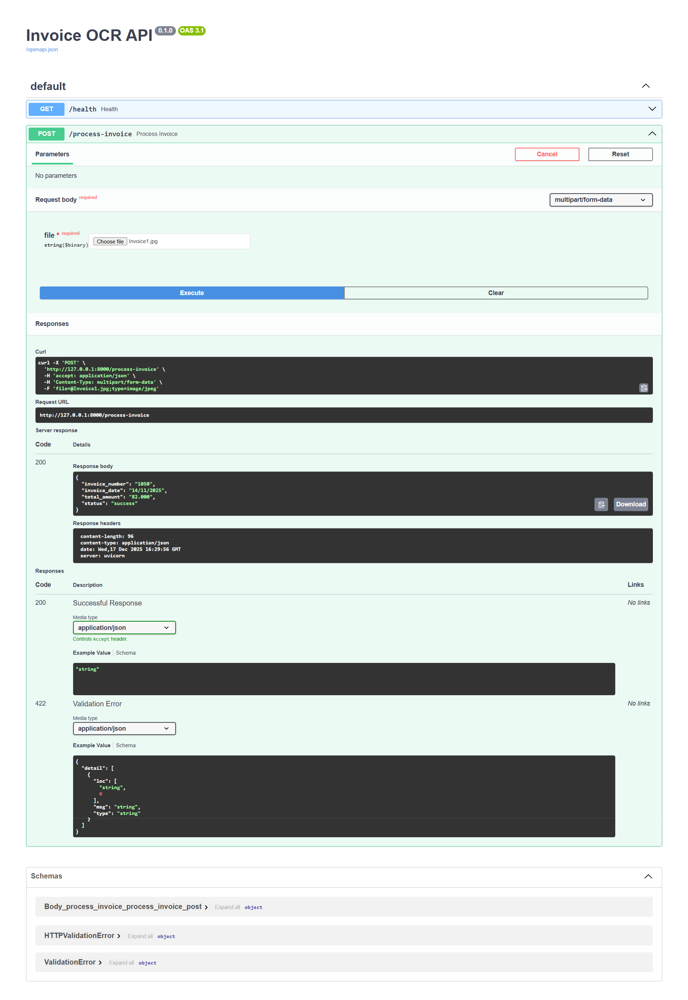

# Invoice OCR Automation System

## Summary
Invoice OCR Automation System adalah project **end-to-end automation** untuk memproses dokumen invoice (PDF & gambar) secara otomatis menggunakan OCR, rule-based AI extraction, database, dan REST API.

## Purpose
Project ini dibuat untuk:
- Mengotomatisasi ekstraksi data invoice yang formatnya tidak konsisten
- Mengurangi input manual dan human error
- Menyediakan service OCR invoice yang siap diintegrasikan dengan sistem lain (web, mobile, RPA)

## Key Features
- OCR invoice PDF & image (Tesseract)
- Ekstraksi data penting (invoice number, tanggal, total pembayaran)
- Automation pipeline + error handling
- Penyimpanan data ke database (SQLite)
- REST API menggunakan FastAPI

## Tech Stack
- Python 3.7  
- Tesseract OCR  
- SQLite  
- FastAPI & Uvicorn  
- Rule-based AI (Regex & Heuristic)

## Output
API mengembalikan hasil ekstraksi invoice dalam format JSON dan menyimpan data ke database untuk kebutuhan audit dan integrasi sistem.

## Demo

